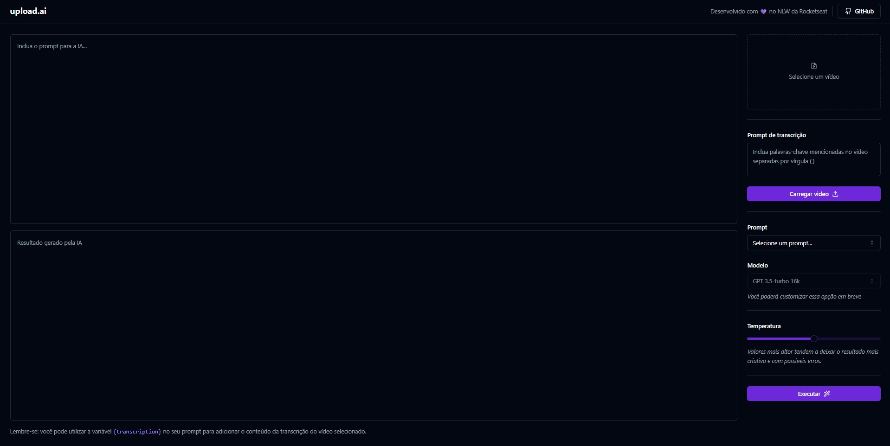

<h1 align="center">
    
upload.ai

</h1>

O upload.ai é uma aplicação com integração a API da OpenAI para realizar requisições a IA. Aqui, podemos fazer o upload do vídeo desejado e passar um contexto para melhor precisão na resposta. Podemos (até o momento) gerar títulos de vídeos e descrições. 

  <a href="#-tecnologias">Tecnologias</a>&nbsp;&nbsp;&nbsp;|&nbsp;&nbsp;&nbsp;
  <a href="#-projeto">Projeto</a>&nbsp;&nbsp;&nbsp;|&nbsp;&nbsp;&nbsp;
  <a href="#-layout">Layout</a>&nbsp;&nbsp;&nbsp;|&nbsp;&nbsp;&nbsp;
  <a href="#memo-licença">Licença</a>

  

 

  

## 🚀 Tecnologias

Esse projeto foi desenvolvido com as seguintes tecnologias:

- HTML, CSS e JavaScript
- Git e Github
- Figma
- Biblotecas:

  - [Vite](https://vitejs.dev/)
  - [ReactJs](https://react.dev/)
  - [NodeJs](https://nodejs.org/)
  - [Typescript](https://www.typescriptlang.org/)
  - [Axios](https://axios-http.com/ptbr/docs/intro)
  - [Tailwind](https://tailwindcss.com/)
  - [shadcn/ui](https://ui.shadcn.com/)
  - [FFmpeg.wasm](https://ffmpegwasm.netlify.app/)
  - [LucideReact](https://lucide.dev/)
  - [Fastify](https://fastify.dev/)
  - [Prisma](https://www.prisma.io/)
  - [OpenAI](https://platform.openai.com/docs/api-reference)
  - [zod](https://zod.dev/)
  - [dotenv](https://www.npmjs.com/package/dotenv)

## 💻 Projeto

O upload.ai é uma aplicação com integração a API da OpenAI para realizar requisições a IA. Aqui, podemos fazer o upload do vídeo desejado e passar um contexto para melhor precisão na resposta. Podemos (até o momento) gerar títulos de vídeos e descrições.

## :memo: Licença

Esse projeto está sob a licença MIT.

---

## ✍ Author
 

    Made with 💜 by Pedro Henrique Klein

    
    

